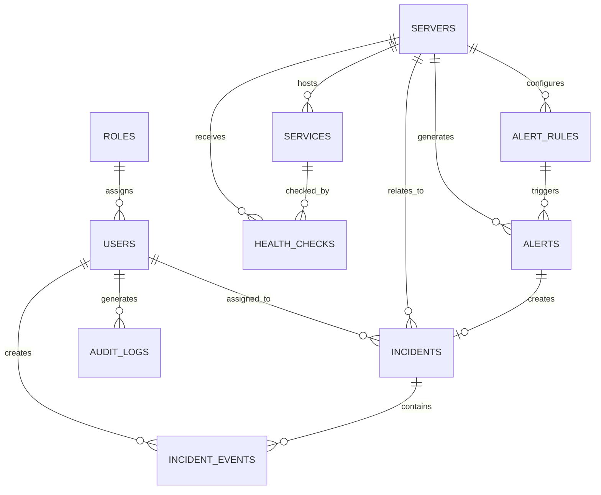

# CloudOps Database Schema

## Overview

CloudOps uses PostgreSQL as its primary application database.

SQLAlchemy provides the ORM layer and Alembic manages schema migrations.

Current database flow:

```text
FastAPI
   |
   v
SQLAlchemy
   |
   v
Psycopg
   |
   v
PostgreSQL
```

---

## Current Tables

The initial CloudOps schema contains:

```text
roles
users
servers
services
health_checks
alert_rules
alerts
incidents
incident_events
audit_logs
```

Alembic also maintains:

```text
alembic_version
```

---

## Entity Relationship Diagram



---

## Roles

Stores CloudOps access-control roles.

Fields:

```text
id
name
description
created_at
updated_at
```

Default roles:

```text
Admin
Engineer
Viewer
```

---

## Users

Stores CloudOps user accounts.

Fields:

```text
id
role_id
username
email
password_hash
is_active
created_at
updated_at
```

Relationship:

```text
users.role_id
        |
        v
roles.id
```

Passwords will be stored as secure password hashes.

---

## Servers

Represents infrastructure monitored by CloudOps.

Fields:

```text
id
name
hostname
ip_address
environment
operating_system
status
is_active
created_at
updated_at
```

Example:

```text
PROD-WEB-01
prod-web-01
192.0.2.10
production
Ubuntu Linux
online
```

Demo infrastructure must use fictional or test addresses.

---

## Services

Represents services running on monitored servers.

Fields:

```text
id
server_id
name
service_type
endpoint
port
status
is_active
created_at
updated_at
```

Relationship:

```text
services.server_id
        |
        v
servers.id
```

---

## Health Checks

Stores monitoring check results.

Fields:

```text
id
server_id
service_id
check_type
status
response_time_ms
details
checked_at
```

Possible check types include:

```text
HTTP
API
DATABASE
SERVER
SERVICE
```

---

## Alert Rules

Stores infrastructure monitoring thresholds.

Fields:

```text
id
server_id
name
metric
warning_threshold
critical_threshold
enabled
created_at
updated_at
```

Constraint:

```text
warning_threshold < critical_threshold
```

Example:

```text
CPU Warning: 70
CPU Critical: 90
```

---

## Alerts

Stores monitoring alerts generated by CloudOps.

Fields:

```text
id
server_id
alert_rule_id
metric
value
severity
status
message
triggered_at
acknowledged_at
resolved_at
```

Possible future states:

```text
active
acknowledged
resolved
```

---

## Incidents

Stores operational incidents.

Fields:

```text
id
incident_number
server_id
alert_id
title
description
severity
status
assigned_to
created_at
acknowledged_at
resolved_at
closed_at
```

Planned lifecycle:

```text
OPEN
  |
  v
ACKNOWLEDGED
  |
  v
INVESTIGATING
  |
  v
RESOLVED
  |
  v
CLOSED
```

---

## Incident Events

Stores the history of an incident.

Fields:

```text
id
incident_id
event_type
description
created_by
created_at
```

Example timeline:

```text
Incident Created
Incident Acknowledged
Engineer Assigned
Investigation Started
Incident Resolved
Incident Closed
```

---

## Audit Logs

Stores administrative and security-sensitive actions.

Fields:

```text
id
user_id
action
resource_type
resource_id
details
created_at
```

Examples:

```text
User created
Role changed
Server registered
Alert rule modified
Incident assigned
Incident resolved
```

---

## Migration Management

Database schema changes are managed through Alembic.

Migration flow:

```text
SQLAlchemy Models
       |
       v
Alembic Autogenerate
       |
       v
Migration Review
       |
       v
alembic upgrade head
       |
       v
PostgreSQL
```

The first CloudOps migration creates the initial application schema.

---

## Role Seeding

Default roles are created using:

```text
scripts/seed_roles.py
```

Run:

```bash
python -m scripts.seed_roles
```

The seed process is idempotent and will not create duplicate roles.

---

## Current Schema Status

```text
PostgreSQL          Configured
SQLAlchemy          Configured
Psycopg             Configured
Alembic             Configured
Initial Migration   Applied
Database Tables     Created
Default Roles       Seeded
```